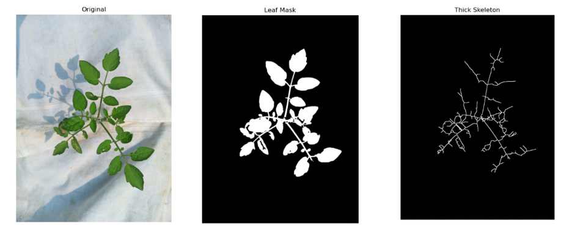

# 🍅 fyp-cv_growth_estimation_yolo_tomato_detection

A hybrid computer vision system for tomato plant growth estimation that combines classical image processing (vegetative index computation) with deep learning (YOLOv8-based fruit detection). The system dynamically switches between growth estimation and fruit detection based on plant stage.

---

## 📊 Dataset

This project uses the **LaboroTomato Dataset**:

🔗 Dataset Repository: https://github.com/laboroai/LaboroTomato  

🔗 Download Link:  
http://assets.laboro.ai.s3.amazonaws.com/laborotomato/laboro_tomato.zip  

---

## 📜 License

This dataset is licensed under:

**Creative Commons Attribution-NonCommercial-ShareAlike 4.0 International (CC BY-NC-SA 4.0)**  
https://creativecommons.org/licenses/by-nc-sa/4.0/

### ⚠️ Usage Terms:
This dataset is used strictly for academic and research purposes. All credits belong to the original authors.
---

## ⚙️ Methodology

This project implements a **dual-model (switchover) system**:

### 🔹 1. Growth Estimation Model (Computer Vision)

Used when no fruits are detected.

#### Steps:
1. Input plant image  
2. Convert image to appropriate color space (e.g., RGB → HSV/ExG)  
3. Compute **Vegetation Index** (e.g., Excess Green Index - ExG)  
4. Apply thresholding to isolate plant region  
5. Perform morphological operations (noise removal, smoothing)  
6. Skeletonization to estimate plant structure  
7. Compute growth metrics:
   - Leaf area / green pixel count  
   - Growth ratio over time  

👉 Output: Growth rate estimation

---

## 📊 Dashboard

### 🔹 2. Fruit Detection Model (YOLOv8)

Activated when fruits are present.

- Model: **YOLOv8 (Ultralytics)**
- Task: Object detection (tomato fruits)
- Output:
  - Bounding boxes  
  - Fruit count  
  - Maturity stage (if trained)

👉 This stage helps shift focus from vegetative growth to yield estimation.

---

## 🔄 Switchover Logic

- If **no fruit detected** → Use vegetation index-based growth estimation  
- If **fruit detected** → Switch to YOLO-based detection  

This ensures:
- Early stage → growth monitoring  
- Later stage → yield estimation  

---

## 🧠 YOLOv8 Model Details

- Framework: Ultralytics YOLOv8  
- Training:
  - Dataset: LaboroTomato  
  - Format: YOLO annotation format  
- Capabilities:
  - Real-time detection  
  - High accuracy with lightweight architecture  

---

## 🚀 Pipeline Overview

1. Input image  
2. Run YOLO detection  
3. If fruits detected:
   - Return detection results  
4. Else:
   - Compute vegetation index  
   - Estimate plant growth  

---
